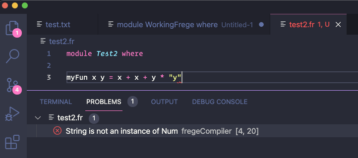
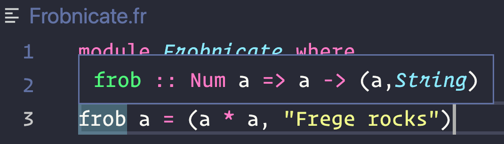

# Frege VSCode
VSCode language client for frege.

## Documentation

Head over to the [Frege IDE docs](https://tricktron.github.io/frege-lsp-server/frege-ide/1.0/index.html) website.

## Install
1. Download the latest version `.vsix` file from [Releases](https://github.com/tricktron/frege-vscode/releases).
2. Install the extension with `code --install-extension <path to downloaded extension.vsix>` or via the Command Palette (Ctrl/Cmd+Shift+P) `Install from VSIX...`.

## Language Server Features

### Diagnostics
If you save or open a frege file with errros then the compiler warnings or errors are displayed in the problem tab of the extension host.



### Hover

Whenever you hover over the first word of a line (which is usually a function), you will see its type signature in a popup.



## Plugin Features

#### Prerequisities

- Gradle and Gradle wrapper. Run `gradle wrapper` in the Frege root project dir.
- A Frege project setup with [Frege Gradle Plugin](https://github.com/tricktron/frege-gradle-plugin) >= 1.5.0. See [examples](./examples).

### Run & Repl Code Lens

If a Frege file contains a `main` function, then a code lens with `Run` and `Repl` appears.

- If you click on the `Run` Code Lens, then the `main` function is executed.
- If you click on the `Repl` Code Lens, then the [Frege Repl](https://github.com/Frege/frege-repl) with all the specified dependencies is started in a new terminal. Also, it copies the command to load the current file to your clipboard so that you only need to paste it into the Repl for a blazingly fast experience:smiley:.

## How to Contribute
- Add more tests and features:smiley:.

### Local Setup
- Install nodejs `14.x`
- `git clone https://github.com/tricktron/frege-vscode.git`
- `npm install`

### How to Debug the Client
- Open the project's root folder in vscode.
- Run the `Release Frege` debug task by pressing `run -> start debugging` or just press `f5`.

This downloads the [frege lsp server](https://github.com/tricktron/frege-lsp-server) and starts both the frege client and server. See the [extension.ts](src/extension.ts) code for more details.

A second vscode instance, called `Extension development host is started`.

Open any `.fr` file in the `extension development host` and try to code some correct Frege functions.

### How to Debug the Client and a Local Frege Server Version
1. `Git clone (https://github.com/tricktron/frege-lsp-server)`
2. Make some changes to the frege lsp server.
3. Run `./gradlew installDist` and note the
startScript path in `<yourRoot>/build/install/frege-lsp-server/bin/frege-lsp-server`.
4. Set the `LOCAL_FREGE_SERVER_PATH` in [launch.json](.vscode/launch.json) to the value in step 3.
5. Run the `Local Frege LSP` debug task.

### How to Debug the Client and a Local Frege Server Version end-to-end with Java Breakpoints in the Server
1. Follow *How to Debug the Client and a Local Frege Server Version*.

2. Add the following `launch.json` to the Frege-lsp-server project:
```json
{
	"version": "0.2.0",
	"configurations": [
		{
			"type": "java",
			"name": "Attach to Frege LSP Server for Debugging",
			"request": "attach",
			"hostName": "localhost",
			"port": 6008
		}
    ]
}
```
3. Set a java breakpoint in the Frege LSP code.
4. Run the `Local Frege LSP with Java Debugging` debug task.
5. Trigger an LSP event in the client.
6. Watch how the breakpoint is automatically hit.
7. Debug

## How to Run the Client Unit tests
- Run `npm test` to execute the [unit tests](test).

## FAQ
### How to Use Behind Corporate Proxy
- Make sure that the `https_proxy` variable is set.
- If you also have self-signed certificates you need to include them
  by setting `export NODE_EXTRA_CA_CERTS=<path to your self-signed CA certs>`.